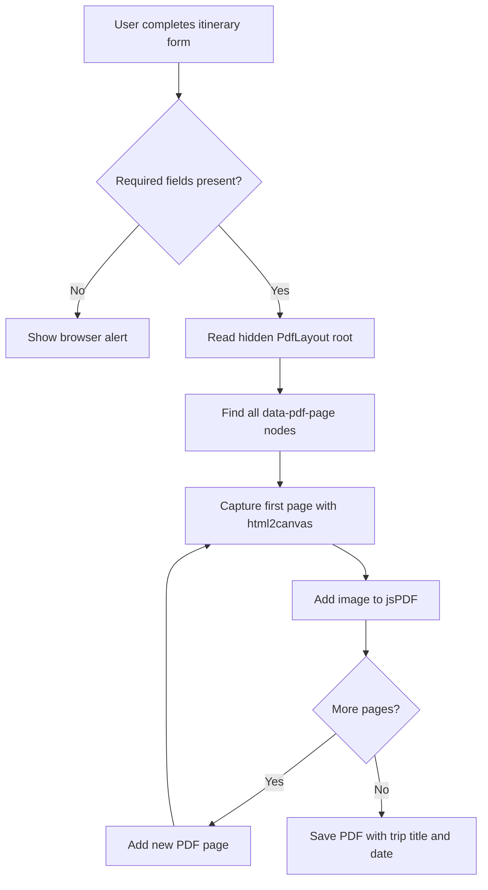
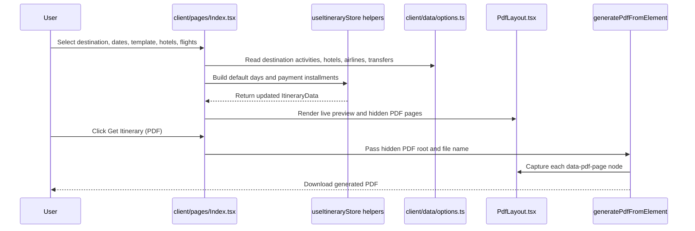
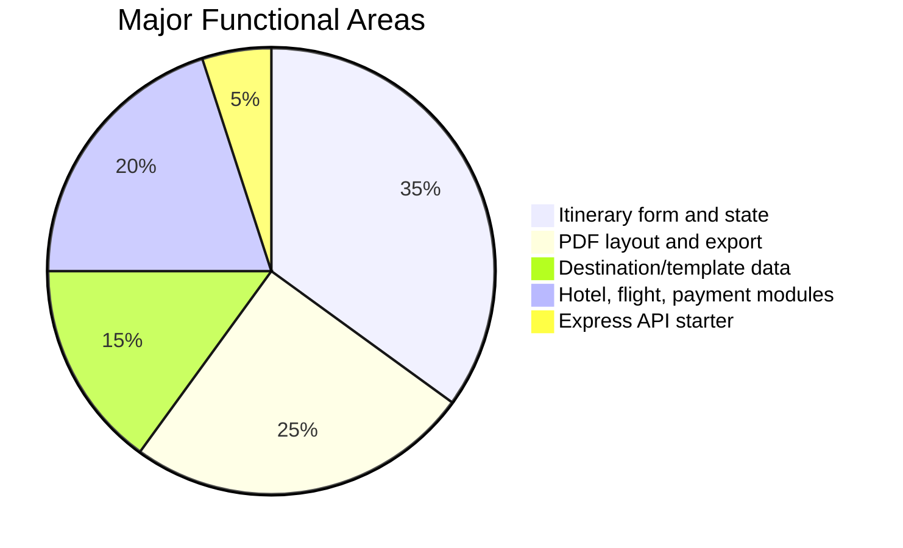

# Itinerary Builder to PDF

A full-stack React application for building polished travel itineraries and exporting them as multi-page PDF documents. The app lets a travel consultant select a destination, trip template, dates, travellers, activities, hotels, flights, inclusions, visa details, notes, and payment installments, then renders the same data into a live preview and downloadable PDF.

## Table of Contents

- [Project Overview](#project-overview)
- [Feature Summary](#feature-summary)
- [Technology Stack](#technology-stack)
- [How the Project Works](#how-the-project-works)
- [Architecture Diagram](#architecture-diagram)
- [PDF Generation Flowchart](#pdf-generation-flowchart)
- [Data Flow](#data-flow)
- [Project Structure](#project-structure)
- [Run the Project Locally](#run-the-project-locally)
- [Available Scripts](#available-scripts)
- [Configuration](#configuration)
- [How to Use the App](#how-to-use-the-app)
- [How to Add New Destinations](#how-to-add-new-destinations)
- [Testing and Quality Checks](#testing-and-quality-checks)
- [Production Build and Deployment](#production-build-and-deployment)
- [Troubleshooting](#troubleshooting)

## Project Overview

This project is designed for travel itinerary creation. Instead of manually preparing a document for every customer, the user fills a structured itinerary builder form and the application automatically formats the data into a branded PDF layout.

The current implementation is a Vite-powered React single-page app with an optional Express API layer. Most itinerary logic runs in the browser. The Express server is available for future server-side features such as authentication, database storage, protected APIs, CRM integrations, or server-side PDF generation.

## Feature Summary

| Area | What It Does | Main Files |
| --- | --- | --- |
| Trip overview | Captures title, destination, template, duration, travellers, departure city, dates, and stopover option. | `client/pages/Index.tsx` |
| Smart defaults | Generates default day plans from selected destination and template. | `client/hooks/useItineraryStore.ts`, `client/data/options.ts` |
| Day builder | Lets the user edit daily activities, dates, transport, hotel assignment, and custom activities. | `client/pages/Index.tsx` |
| Flights and transfers | Adds flight details with airline, time, route, and class. | `client/pages/Index.tsx` |
| Hotel bookings | Captures city, check-in, check-out, nights, and hotel names. | `client/pages/Index.tsx` |
| Payments | Supports full payment, two-installment, three-installment, and custom installment plans. | `client/hooks/useItineraryStore.ts` |
| Live preview | Shows a scrollable preview of the final PDF layout. | `client/components/PdfLayout.tsx` |
| PDF export | Converts each PDF page DOM node into an image and saves it through jsPDF. | `client/utils/pdf.ts` |
| API starter | Includes sample `/api/ping` and `/api/demo` endpoints for future backend work. | `server/index.ts`, `server/routes/demo.ts` |

## Technology Stack

| Layer | Technology | Purpose |
| --- | --- | --- |
| Frontend | React 18, TypeScript, React Router | Main user interface and routing |
| Build tool | Vite | Development server, hot reload, production bundling |
| Styling | Tailwind CSS, Radix UI, Lucide React | Responsive UI, reusable components, icons |
| PDF generation | html2canvas, jsPDF | Browser-side PDF creation |
| Backend | Express | Optional API layer mounted into Vite during development |
| Validation/testing | TypeScript, Vitest | Type checking and unit tests |
| Deployment | Netlify config included | Static/client deployment with optional serverless API |

## How the Project Works

The app keeps itinerary data in React state. User actions update that state, and two UI surfaces consume it:

1. The visible builder form, where the user edits trip information.
2. The PDF layout component, which is rendered both as a live preview and as a hidden print-ready DOM tree.

When the user clicks **Get Itinerary (PDF)**, the app finds every element marked with `data-pdf-page`, captures each page with `html2canvas`, inserts those images into `jsPDF`, and downloads a PDF file.

## Architecture Diagram

```mermaid
flowchart LR
  User[Travel consultant] --> UI[React itinerary builder]
  UI --> State[ItineraryData state]
  State --> Preview[Live PDF preview]
  State --> HiddenPDF[Hidden PDF DOM pages]
  HiddenPDF --> Canvas[html2canvas page screenshots]
  Canvas --> PDF[jsPDF document]
  PDF --> Download[Downloaded itinerary PDF]

  UI --> Options[Destination, template, hotel, airline data]
  Options --> State

  UI -. optional API calls .-> API[Express API]
  API --> Routes[/api/ping and /api/demo]
```

## PDF Generation Flowchart



## Data Flow



## Feature Coverage Chart



## Project Structure

```text
.
|-- client/
|   |-- App.tsx                    # React app shell and routes
|   |-- global.css                 # Tailwind theme and global styles
|   |-- components/
|   |   |-- PdfLayout.tsx           # Multi-page itinerary PDF design
|   |   `-- ui/                     # Reusable UI components
|   |-- data/
|   |   `-- options.ts              # Destinations, hotels, airlines, templates
|   |-- hooks/
|   |   `-- useItineraryStore.ts    # Itinerary types and helper functions
|   |-- pages/
|   |   |-- Index.tsx               # Main itinerary builder screen
|   |   `-- NotFound.tsx
|   `-- utils/
|       `-- pdf.ts                  # html2canvas + jsPDF export helper
|-- server/
|   |-- index.ts                    # Express server setup
|   |-- node-build.ts               # Production server entry
|   `-- routes/
|       `-- demo.ts                 # Example API route
|-- shared/
|   `-- api.ts                      # Shared client/server API types
|-- netlify/
|   `-- functions/api.ts            # Netlify serverless API wrapper
|-- public/                         # Static assets
|-- package.json                    # Scripts and dependencies
|-- vite.config.ts                  # Vite client/dev-server config
|-- vite.config.server.ts           # Server build config
|-- tailwind.config.ts              # Tailwind configuration
`-- tsconfig.json                   # TypeScript configuration
```

## Run the Project Locally

### Prerequisites

Install these tools before running the project:

| Tool | Recommended Version | Why It Is Needed |
| --- | --- | --- |
| Node.js | 20 LTS or newer | Runs the JavaScript toolchain |
| npm | Comes with Node.js | Installs dependencies and runs scripts |
| pnpm | 10.x, optional | The project includes a `pnpm-lock.yaml` and package manager pin |

This repository can be run with either npm or pnpm. npm is the simplest option on most Windows machines.

### Option A: Run with npm

```bash
npm install
npm run dev
```

Open the local URL shown by Vite. By default, the project uses:

```text
http://localhost:8080
```

### Option B: Run with pnpm

If pnpm is already installed:

```bash
pnpm install
pnpm dev
```

If pnpm is not installed but Corepack is available:

```bash
corepack enable
corepack prepare pnpm@10.14.0 --activate
pnpm install
pnpm dev
```

### Windows PowerShell Note

If PowerShell blocks `npm` or `pnpm` scripts with an execution policy error, use the `.cmd` executable:

```powershell
npm.cmd install
npm.cmd run dev
```

## Available Scripts

| Script | Command | Description |
| --- | --- | --- |
| Development | `npm run dev` | Starts Vite on port `8080` with the Express API mounted as middleware. |
| Type check | `npm run typecheck` | Runs TypeScript validation. |
| Test | `npm test` | Runs Vitest unit tests. |
| Build | `npm run build` | Builds the client and server output into `dist/`. |
| Start production | `npm start` | Runs the built server from `dist/server/node-build.mjs`. |
| Format | `npm run format.fix` | Formats the codebase with Prettier. |

## Configuration

### Environment Variables

The server reads environment variables through `dotenv/config`. The sample `/api/ping` endpoint uses:

```env
PING_MESSAGE=ping
```

Do not expose private keys in frontend code. If future features require secrets, place the logic behind Express routes or serverless functions.

### Vite Server

The dev server is configured in `vite.config.ts`:

```ts
server: {
  host: "::",
  port: 8080
}
```

Change `port` if another app is already using `8080`.

## How to Use the App

1. Open the app in the browser.
2. Fill the trip title, destination, template, duration, travellers, departure city, and dates.
3. Review or edit generated day-wise activities.
4. Add traveller and visa details if required.
5. Add flights, hotel booking rows, inclusions, notes, scope, total amount, and payment installments.
6. Check the live preview on the right side.
7. Click **Get Itinerary (PDF)** to download the itinerary.

## How to Add New Destinations

Most destination data lives in `client/data/options.ts`.

To add a new destination:

1. Add a new key under `destinations`.
2. Provide `activities`, `hotels`, `airlines`, and `transfers`.
3. Ensure each activity and hotel has a unique `id`.
4. Update template mappings in `mapTemplateKeyToActivityId` if the destination needs special activity IDs.
5. Run `npm run typecheck`.
6. Start the app and verify that the destination appears in the dropdown.

Example shape:

```ts
Paris: {
  activities: [
    { id: "eiffel", title: "Eiffel Tower", type: "Sightseeing", duration: "2 Hours" }
  ],
  hotels: [
    { id: "par_h1", name: "Central Paris Hotel", city: "Paris" }
  ],
  airlines: ["Air France", "Vistara"],
  transfers: ["Private Car", "Metro", "No Transfer"]
}
```

## Testing and Quality Checks

Run these before sharing or deploying changes:

```bash
npm run typecheck
npm test
npm run build
```

Recommended manual checks:

- Verify that changing destination regenerates relevant activities and hotels.
- Verify that departure date updates all day dates and return date.
- Add at least one flight and one hotel booking row.
- Generate a PDF and inspect all pages.
- Test the app on desktop and mobile widths.

## Production Build and Deployment

Build the project:

```bash
npm run build
```

Run the production server:

```bash
npm start
```

For Netlify, the repository already includes:

- `netlify.toml`
- `netlify/functions/api.ts`

The static app is built from Vite, while the API can be exposed through Netlify Functions if backend routes are needed in production.

## Troubleshooting

| Problem | Likely Cause | Fix |
| --- | --- | --- |
| `pnpm` is not recognized | pnpm is not installed globally | Use `npm install`, or install/activate pnpm through Corepack. |
| PowerShell blocks `npm.ps1` | Windows execution policy | Run `npm.cmd install` and `npm.cmd run dev`. |
| Port `8080` is busy | Another app is using the dev server port | Change `server.port` in `vite.config.ts`. |
| PDF is blank or incomplete | Hidden PDF layout did not render before capture, or browser blocked canvas content | Ensure the form has required data and use same-origin assets. |
| Dates look incorrect | Browser timezone/date parsing edge case | Keep dates in `yyyy-MM-dd` format and verify date calculations after changing duration. |
| Build/test cannot load Vite config in a restricted environment | The runner is blocking filesystem reads above the project folder | Run commands from the project root in a normal terminal with full access. |

## Current Verification

This project was inspected as a React + Vite + Express itinerary builder. TypeScript validation completed successfully with:

```bash
npm.cmd run typecheck
```

Dependency installation was completed with:

```bash
npm.cmd install
```

If you are running on Windows PowerShell, prefer `npm.cmd` commands when script execution is restricted.
